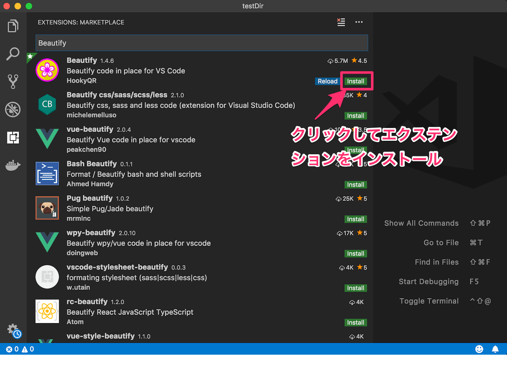

# VS Code入門

## 目的

- VS Codeをインストールする。
- VS Codeの基本的な使い方を知る。
- エクステンションのインストール方法を知る。

## VS Codeとは

VS Codeは現在プログラマーの間で最も人気のあるエディタの一つです。VS Codeは以下のような理由で人気です。

- Mac、Windows、Linux全てのOSで利用できる
- 豊富なパッケージ
- Micorosoftによって作られている
- オープンソースであること

オープンソースという言葉を聞いたことがあるでしょうか？これは簡単に言うと、コードを社内だけのものにせずに誰でも中を見ることが出来て、誰でも編集することが出来るようなプロジェクトの総称です。多くのエディタが有料でコードを見ることが出来ないようにしているのに対して、Atomエディタは全てのコードをオープンして誰でも改善が出来るようにしています。そのために、有料のエディタよりも使い勝手が良く、また豊富なパッケージで自分好みのカスタマイズが簡単に出来るようになっています。プロジェクトの開発元はMicrosoftであり、信頼性が非常に高く、今後開発が放棄されてしまうようなことが考えにくいことも人気の理由です。

## インストール

まずはVS Codeをインストールしましょう。以下の手順に沿って下さい。

1. [VS Codeの公式サイト](https://code.visualstudio.com/Download)から、自分のOSに合うパッケージをダウンロードします。
2. ダウンロードされたファイルを解凍して、指示に従ってインストールしましょう。

## 開いてみよう

ダウンロードしたアプリケーションを開いてみましょう。すると次のようにWelcomeページが開くはずです。

## コマンドパレットを使おう

無事に開いたらまずはコマンドパレットを開いてみます。

"command"と”Shift"と"P"を同時に押して見て下さい。すると次の画像のようになるはずです。

画像のオレンジ色で囲まれた部分がコマンドパレットです。

VS Codeを使って開発するときは、このコマンドパレットを上手く使うことで開発速度を上げることが出来ます。以下ではこのコマンドパレットを利用することを前提に様々な操作を行っていきます。

## フォルダーを開く

フォルダーを開く方法は複数あります。

1. フォルダをVS Codeのアイコン上にドラッグ&ドロップする。

2. VS Code上で"Command + O"を押す。

ショートカットキー"Command + O"でフォルダーを選ぶことが出来ます。メニューバーのFileからOpenを選んで開く方法もありますが、頻繁に行う操作ですのでショートカットを覚えることをオススメします。

## フォルダやファイルを作成する

フォルダやファイルの作成は画面左側の現在開いてるフォルダ名の横にあるアイコンからファイルやフォルダを作成出来ます。

## 文字検索を使う

文字検索を使ってみましょう。まずは、テスト用のフォルダを作ってそこにtest.txtというテキストファイルを作成しましょう。ファイルが出来たら、そこに以下の文章を3回コピー&ペーストしてください。

"Lorem ipsum dolor sit amet, consectetur adipiscing elit, sed do eiusmod tempor incididunt ut labore et dolore magna aliqua. Ut enim ad minim veniam, quis nostrud exercitation ullamco laboris nisi ut aliquip ex ea commodo consequat. Duis aute irure dolor in reprehenderit in voluptate velit esse cillum dolore eu fugiat nulla pariatur. Excepteur sint occaecat cupidatat non proident, sunt in culpa qui officia deserunt mollit anim id est laborum."

この文章は、プログラマがよく文章を埋めたい時に使う"Lorem Ipsum"という文章です。

準備が完了したらファイル内で`Ctrl + F`と押して見て下さい。すると検索ボックスが立ち上がります。検索ボックスが立ち上がったら"Lorem"と入れてEnterキーを押して検索してみましょう。

すると画像の用に"Lorem"の部分が枠で囲まれて表示されるはずです。

## 文字の置換を使う

次に文字の置換を使ってみましょう。先程のファイルを開いたままで"Alt + Command + F"を押してみましょう。
すると検索用のウィンドウが置換用のウィンドウに切り替わります。

そうしたら、Loremの文字を試しに"Test"に変更してみましょう。Loremと書いたボックスの下にTestと書いてEnterキーを押すと、文字が置換されるはずです。

検索や置換は、選択した範囲だけに適用することができる他、大文字と小文字を区別するかどうかを選んだり、1個ずつ置換するか、一度に全ての箇所を置換するかを選べたり出来ます。

## エクステンションをインストールする

VS Codeの特徴として、様々なエクステンション(プラグイン)が公開されており、これらをインストールすることでより快適にエディタを使えるという点があります。

エクステンションをインストールするには、エディタの左側の四角のアイコンをクリックします。

すると、現在インストールされているエクステンションや、オススメのエクステンションが表示されます。ここでは、便利なエクステンションの一つである"Beautify"をインストールしてみましょう。

まずは開いている画面の検索ボックスに"Beautify"と入れて検索します。すると一番上に"Beautify"というエクステンションが表示されるはずです。installと書かれたボタンをクリックするとインストールが行われます。

このBeautifyを使うと、HTMLファイルやCSSファイルのインデントを簡単に揃えることが出来便利です。

## VS Code Live Shareをインストールする

VS Code Live Shareを使うことで、自分のコードやターミナルをメンターとリアルタイムにシェアすることが出来ます。面談開始前にこのエクステンションは入れるようにして下さい。

利用方法については公式サイトを参考にしてください。

[Visual Studio Live Share - 公式サイト](https://visualstudio.microsoft.com/ja/services/live-share/)

## その他の便利なエクステンション

その他に便利なエクステンションとしては以下のようなものがあります。

1. IntelliSense

このプラグインはプログラミング言語やライブラリごとに多数あります。このプラグインを入れると、コマンドを入力している時に、その後の内容を予測して自動的に保管してくれます。例えば、CSSなら"IntelliSense for CSS class names in HTML"というエクステンションを入れましょう。

2. Auto Close Tag

このプラグインを入れると、HTMLのタグを書いているときに自動的にクローズタグを入れてくれます。これもHTML/CSSでの開発速度を上げてくれますので是非利用して下さい。

## まとめ

エクステンションは、書いているプログラミング言語やライブラリによっても多数ありますので、例えばHTML/CSSコースのときはHTML/CSS関連のもの、JavaScriptコースを学んでいる際はESLintなどJavaScript関連のエクステンションを入れてより快適に開発ができるようにしていきましょう。

## 更に学ぼう

### 記事で学ぶ

- [VS Code公式ドキュメント(英語)](https://code.visualstudio.com/docs)

- [Visual Studio Codeの使い方、基本の「キ」- @IT](http://www.atmarkit.co.jp/ait/articles/1507/10/news028.html)